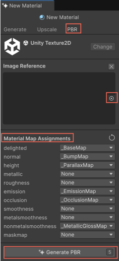

# Add effects to a generated material surface with the PBR tab

The **PBR** (physically based rendering) tab in Material Generator simulates how light interacts with the material's surface. It adds realistic effects, such as ripples, gloss, and metallic shines.

To use the **PBR** tab, follow these steps:

1. In the Material Generator, select the **PBR** tab.
1. To influence the material further, select the browse icon in the **Image Reference** section to open the **Select Texture 2D** window.
1. Select an image to influence the material’s appearance.

   

1. In the **Material Map Assignments** section, assign maps for different material properties. 

   For more information on different maps or layers, refer to [Material Map Assignments](#material-map-assignments).

1. Select **PBR**.

## Material Map Assignments

A material in Unity consists of multiple layers or maps that combine to create the final visual representation. 

Material Generator defines a material's appearance and behavior using two components:

* **Base map**: Acts as the foundation of the material. It represents how the material will look if there are no other surface details applied. Material Generator creates this map as the starting point for the material.

* **Surface layers**: Additional maps that add depth and texture. These layers simulate lifelike effects, such as ripples, roughness, or reflections.
For instance, wood might have visible grain and metal might shine or reflect light. 

You create the base map first and then enhance it with surface layers.

The following table shows the available map types:

| Map | Description |
| --- | ----------- |
| **delighted** | Specifies the base color or diffuse texture of the material. It determines the color and basic surface detail without lighting effects. |
| **normal** | Creates the illusion of surface details, such as bumps, grooves, or scratches. |
| **height** | Adds depth information to the material, simulating physical ridges or indentations. |
| **metallic** | Controls the metallic properties of the material, affecting how much light is reflected by its surface. |
| **smoothness** | Determines how smooth or rough the material’s surface is, influencing its light reflection. |
| **emission** | Makes certain areas of the material appear to emit light, giving it a self-illuminated look. |
| **occlusion** | Adds shadows where ambient light would be blocked or occluded. |
| **metalsmoothness** | Combines metallic and smoothness maps into a single texture. |
| **nonmetalsmoothness** | Handles non-metallic surface areas, integrating smoothness with non-metallic properties. |
| **maskmap** | Combines multiple maps into a single texture for more complex material properties. This map is most often used with Unity's HDRP render pipeline. |

## Additional resources

* [Use the Upscale tab](xref:material-upscale)
* [Manage generated material](xref:material-manage)