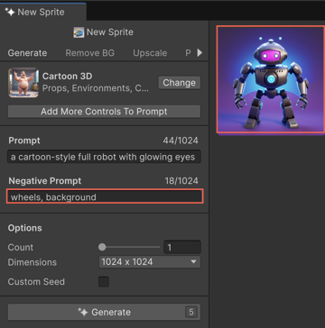

# Remove unwanted elements with negative prompts

Use a negative prompt to exclude unwanted elements from the generated asset. While the main prompt describes what the asset might include, the negative prompt tells the generator what to leave out. This refines the asset and reduces visual noise.

Negative prompts work across all Generators, including Sprite, Texture, Sound, and Material. You specify a negative prompt in the **Negative Prompt** field in the Generator window.

Use negative prompts when:

* The generated asset includes unwanted elements like backgrounds, objects, or styles.
* You want to remove specific visual features or distractions.
* You want a clean and simple output.

To write a negative prompt, use the following guidelines:

* Use keywords that describe what you want to exclude.
* Separate multiple keywords with commas.
* Avoid using `no` in your negative prompt. For example, instead of writing `no birds`, just write `birds`.

## Negative prompt examples

In the following example, the prompt describes a `cartoon-style full robot with glowing eyes`, while the negative prompt specifies `wheels, background`. This tells the generator to exclude those elements from the generated sprite.

The following examples show how negative prompts can influence generated results based on different prompt combinations. 

> [!NOTE]
> The output varies significantly depending on the selected model.

| Prompt | Negative Prompt | Effect |
| ------ | --------------- | ------ |
| a sunny sky | glare | Generates a bright sky without light flares |
| a mountain at sunset | birds | Omits birds flying across the sunset |
| a fantasy village | fog, shadows | Produces a clearer view without atmospheric haze |
| a glowing crystal cavern | dark, gloomy | Avoids dim or moody lighting |
| a sci-fi robot character | wires, damage | Removes exposed wiring or broken parts |

## Additional resources

* [Generate sprite with a prompt](xref:generate-sprite)
* [Generate Texture2D asset with a prompt](xref:generate-texture2d)
* [Generate sound asset with a prompt](xref:sound-prompt)
* [Generate material with a prompt](xref:material-generate-prompt)