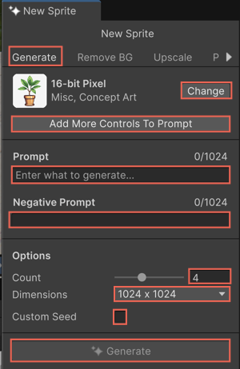

# Generate sprite with a prompt

To generate sprites, write a prompt that describes the sprite you want to generate.

To generate a sprite, follow these steps:

1. To open the Sprite Generator window, right-click an empty area in the **Project** window.
1. Select **Create** > **2D** > **Generate Sprite**.

    

1. To choose a model, select **Change**.

   The **Select Model** window opens. It displays the third-party AI models from partners, such as Scenario and Layer. For more information, refer to [Choose the right model with the Model Picker](xref:animation-intro).

1. Filter and search for models by tags or specific training styles, for example, **Anime** or **Cartoon 3D**.
1. Select a model suited for the type of sprite you want to create.
1. In the **Prompt** field, describe the sprite you want to generate.

   For example, `a blue dog`.

1. To exclude specific elements, enter the keywords in the **Negative Prompt** field.

   For example, `extra legs`.

   For more information on negative prompts, refer to [Remove unwanted elements with negative prompts](xref:negative-prompt).
1. Set the following sprite properties:

   1. To set the number of sprites to generate, move the **Images** slider.
   1. Select the output sprite size from the **Dimensions** list.
   1. To specify a custom seed to generate consistent results, enable **Custom Seed** and enter a seed number.

      Every 2D sprite you generate has a seed. A seed is a number that you enter or that the tool generates automatically.

      For more information on custom seed, refer to [Use a custom seed to generate consistent sprites](xref:custom-seed).
1. Select **Generate**.

The button label displays the Unity Points cost for generating the asset. This number shows how many Unity Points will be deducted when you use the feature.

The generated sprite appears in the **Generations** panel and the **Inspector** window. You can click the **Generate** button in the **Inspector** to open the Sprite Generator window. For more information, refer to [Generate window](xref:generate-window-sprite).

Hover over a sprite the **Generations** panel to view details, such as the model used and prompt settings.

> [!NOTE]
> To generate and assign assets directly, refer to [Generate and assign assets with the Object Picker](xref:asset-picker).

> [!NOTE]
> Sprite Generator stores the generated sprites in the `/GeneratedAssets` folder located at the root of your project. These assets remain in that folder until you remove them manually.

## Additional resources

* [Generate window](xref:generate-window-sprite)
* [Generate sprite from a reference images](xref:reference-sprite)
* [Manage generated sprites](xref:manage-sprite)
* [Use a custom seed to generate consistent sprites](xref:custom-seed)
* [Generate and assign assets with the Object Picker](xref:asset-picker)
* [Prompt guidelines for asset generation](xref:prompts)