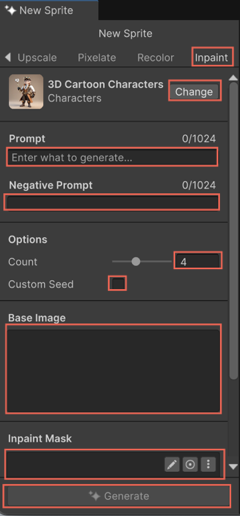

# Modify generated sprites

Sprite Generator provides several post-processing options to refine the generated sprites. Use the different tabs in the **Generate** window to modify the generated sprites.

## Remove background

Use the **Remove BG** tab to remove the background elements from the generated sprite.

1. In the **Generate** window, select the **Remove BG** tab.
1. Select **Remove BG**.

## Upscale

Use the **Upscale** tab to increase the resolution of the generated sprite without losing detail.

1. In the **Generate** window, select the **Upscale** tab.
1. Select **Change** to choose a model from the **Select Model** window.
1. Select **Upscale**.

View the upscaled image in the **Generations** panel. The resolution badge (for example, **2K** or **4K**) appears in the top-left corner of the image.

## Pixelate

Use the **Pixelate** tab to convert the sprite into a pixel art style.

1. In the **Generate** window, select the **Pixelate** tab.
1. Adjust the following settings:

   | Setting | Description |
   | ------- | ----------- |
   | **Size** | Defines the pixel size. |
   | **Keep Image Size** | Retains the original sprite size. |
   | **Sampling Size** | Sets the number of neighboring pixels to sample. |
   | **Pixelate Mode** | Selects how the pixelation is applied.  The following options are available:  * **Centroid**: Averages the color of pixels within a grid cell based on their center point. It creates a smooth and balanced pixelation effect.  * **Contrast**: Enhances the contrast between adjacent pixels to clearly define the edges. * **Bicubic**: Uses bicubic interpolation to calculate pixel values. The resulting effect is smoother and more natural. * **Nearest**: Assigns the color of the nearest pixel. It produces a sharper pixelation effect.  * **Center**: Uses the color of the pixel at the center of each grid cell. It results in a consistent and uniform appearance.  * **Outline Thickness**: Adjusts the thickness of the pixel outline. |
1. Select **Pixelate**.

## Recolor

Use the **Recolor** tab to customize the color palette used in the sprite.

1. In the **Generate** window, select the **Recolor** tab.
1. In the **Palette Reference** field, select the **Paint Brush** tool.

   The **Doodle** window opens. Use the following tools:

   | Tool | Description |
   | ---- | ----------- |
   | **Paint Brush** | Colors directly on the canvas. |
   | **Eraser** | Erases existing color from the canvas. |
   | **Paint** | Fills the canvas with the selected color. |
   | **Color Picker** | Selects a color from the canvas. |
   | **Brush Size** | Adjusts the brush size. |
   | **Show BaseImage** | Previews the original sprite while you recolor it. |
1. Select **Recolor** to apply the new color scheme.

## Inpaint

Use the **Inpaint** tab to refine specific areas of the sprite with masking. You can adjust the mask with brush settings and an eraser.

1. In the **Generate** window, select the **Inpaint** tab.
1. In the **Prompt** field, specify the object that you want to insert in the area defined by the mask.

   > [!NOTE]
   > Don't leave the **Prompt** field blank.

    

1. In the **Inpaint Mask** field, select the **Paint Brush** tool.

   The **Doodle** window opens.
1. Paint a mask over the area you want to modify.

   For more information on the tools available in the **Doodle** window, refer to the [Recolor](#recolor) section.

1. Select **Generate** to regenerate the masked area.

## Additional resources

* [Generate sprite with a prompt](xref:generate-sprite)
* [Manage generated sprites](xref:manage-sprite)