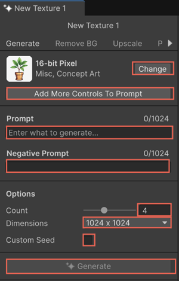

# Generate Texture2D asset with a prompt

Texture2D Generator generates 2D images that you can use to create a sprite, backdrop, or billboard. For example, you can use a generated image as the albedo texture map of an unlit material on a billboard that represents a tree.

To generate 2D images using [Texture2D](https://docs.unity3d.com/6000.0/Documentation/ScriptReference/Texture2D.html) Generator, follow these steps:

1. To open the Texture2D Generator window, right-click an empty area in the **Project** window.
1. Select **Create** > **Rendering** > **Generate Texture 2D**.

   

1. To choose a model, select **Change**.

   The **Select Model** window opens. It displays the third-party AI models from partners like Scenario and Layer. 
1. Filter and search for models by tags or specific training styles, for example, **Anime** or **Cartoon 3D**. 
1. Select a model suited for the type of image you want to create.
1. In the **Prompt** field, describe the image you want to generate.

   For example, `Large tall tree`.

1. To exclude specific elements, enter the keywords in the **Negative Prompt** field.

   For example, `leaves`.

   For more information on negative prompts, refer to [Remove unwanted elements with negative prompts](xref:negative-prompt).
1. Set the following image properties:

   1. To set the number of images to generate, move the **Images** slider.
   1. Select the output image size from the **Dimensions** list.
   1. To specify a custom seed to generate consistent results, enable **Custom Seed** and enter a seed number.
   
      Every 2D image you generate has a seed. A seed is a number that you enter or that the tool generates automatically.

      For more information on custom seed, refer to [Use custom seed to generate consistent sprites](xref:custom-seed). 
1. Select **Generate**.

   The generated images appear in the **Generations** panel. Hover over an image to view details, such as the model used and prompt settings.

   > [!NOTE]
   > Texture2D Generator saves all the generated textures in the `/GeneratedAssets` folder located at the root of your project. These assets remain in that folder until you remove them manually.

## Additional resources

* [Generate Texture2D asset with a prompt](xref:generate-texture2d)
* [Generate window](xref:generate-window)
* [Texture2D](https://docs.unity3d.com/6000.0/Documentation/ScriptReference/Texture2D.html)
* [Use custom seed to generate consistent sprites](xref:custom-seed)