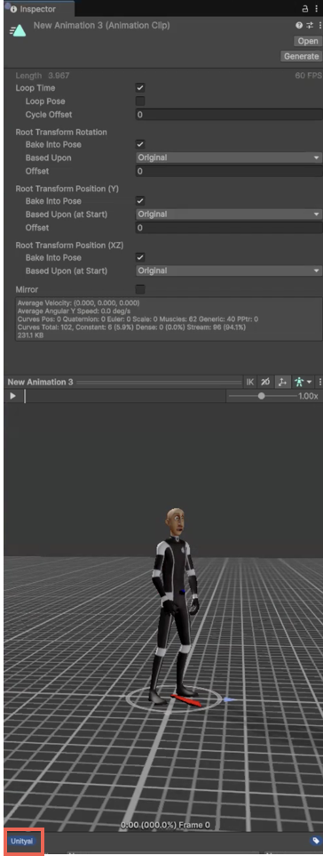

By default, newly created Unity assets don't have any labels assigned. When you generate an asset and apply that generation to it, the asset is automatically tagged with the `Unityai` label. This label lets you identify, search, and organize assets created with Generators.

To locate all assets with the `Unityai` label, use one of the following ways:

* Enter `Unityai` in Unity's Search window.
* Right-click any asset and select **Search Generated Assets**.

The search result shows a list of all assets in your project that had generation applied to them.

> [!NOTE]
> The `Unityai` label isn't applied when the asset is first created. It's only added when you generate and assign the resulting generation to the asset.