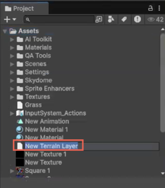
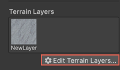

# Terrain Layer Generator

Use the Terrain Layer Generator to generate and apply materials directly to Unity [Terrain Layers](https://docs.unity3d.com/6000.1/Documentation/Manual/class-TerrainLayer.html). Unlike [Material Generator](xref:material-overview), which applies textures to generic meshes (for example, cubes or spheres), the Terrain Layer Generator specifically produces materials compatible with Terrain objects.

You can access the generator in two ways:

* [From a Terrain Layer asset in the **Project** window](#option-1-generate-from-a-terrain-layer-asset)
* [From a Terrain object in the **Scene** view](#option-2-generate-from-a-terrain-object)

## Option 1: Generate from a Terrain Layer asset

To generate a Terrain Layer from the **Project** window, follow these steps:

1. In the **Project** window, right-click and select **Create** > **Terrian** > **Generate Terrian Layer**.

   A new Terrain Layer asset appears in the **Project** window.

   

1. Double-click the new Terrain Layer asset to open the **New Terrain Layer** Generator window.

1. Enter a prompt. For example, `sand` or `grass`.
1. Specify other settings as needed.
1. Select **Generate**.
1. If you have generated multiple Terrain Layer assets, you can switch between them to choose a preferred **Diffuse** map.

   Each generated Terrain Layer includes maps, such as **Diffuse**, **Normal**, and **Mask**.

1. In the **Material Map Assignments** tab, assign the generated maps to their corresponding slot.
1. In the **PBR** tab, use the **Material Map Assignments** section to apply the maps to the generated Terrain Layer asset.
1. Select **Generate PBR**.

The Terrain Layer asset now includes **Diffuse** and **Normal** maps. You can apply it to the Terrain objects in the scene.

## Option 2: Generate from a Terrain object

To create and apply a new Terrain Layer directly in the scene, follow these steps:

1. In the **Hierarchy** window, right-click and select **GameObject** > **3D Object** > **Terrain** to add a Terrain object to your scene.
1. In the **Terrain Layer** section, select **Edit Terrain Layers** > **Add Layer**.

   

   When you generate Terrain Layers, Unity might open either the Material Generator or the Texture Generator depending on the action taken.

     * **Add Layer** opens the Material Generator.
     * **Create Layer** opens the Texture Generator.
     This behavior is expected and based on the selected workflow.

1. Select an existing Terrain Layer asset you want to apply to the Terrain object or select **Generate New** to create a new Terrain Layer asset.
1. In the **New Terrain Layer** Generator window, specify the prompt. For example, `stone`.
1. Select **Generate**.

   The generated Terrain Layer asset appears in the **Inspector** > **Terrain Layer** section.
1. Select the new Terrain Layer asset and apply it to the Terrain using the mouse.

To view all Terrain Layers applied in the scene:

* Select the **Terrain** object in the **Hierarchy**.
* In the **Inspector**, select **Generate**.

   If you add or select an empty Terrain, the **New Terrain Layer** Generator window opens. You can generate and apply a new Terrain Layer.

## Additional resources

* [Terrain](https://docs.unity3d.com/6000.1/Documentation/Manual/script-Terrain.html)
* [Generate material with a prompt](xref:material-generate-prompt)
* [Use the PBR tab](xref:material-pbr)
* [Prompt guidelines for asset generation](xref:prompts)